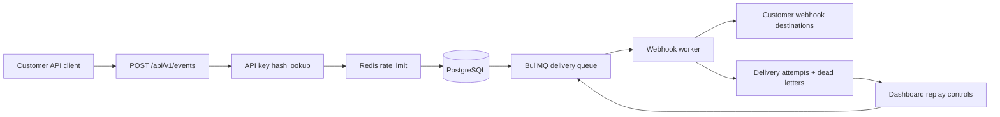

# PulsePipe

PulsePipe is a portfolio-grade multi-tenant event ingestion and webhook delivery SaaS. It demonstrates API-key authentication, asynchronous queue processing, Redis rate limiting, replayable dead letters, workspace isolation, and an operational dashboard built with Next.js 15, PostgreSQL, Prisma, Redis, and BullMQ.

## Architecture



## Event Lifecycle

1. A customer sends `POST /api/v1/events` with `Authorization: Bearer <api_key>`.
2. PulsePipe hashes the presented key with SHA-256 and looks up an active workspace-scoped key.
3. Redis applies a per-API-key fixed-window rate limit.
4. The event is validated with Zod, stored in PostgreSQL, and queued for every enabled destination.
5. The BullMQ worker signs the webhook payload with HMAC SHA-256 and records every attempt.
6. Failed deliveries retry with exponential backoff. Final failures become `dead_letter`.
7. Operators replay a single failed attempt, every failed delivery for an event, or failures for a destination.

## Local Setup

```bash
cp .env.example .env
npm install
docker compose up postgres redis -d
npm run db:generate
npm run db:migrate
npm run db:seed
npm run dev
```

In a second terminal:

```bash
npm run worker
```

Or run the full stack:

```bash
docker compose up --build
```

Open `http://localhost:3002` when using Docker Compose, or `http://localhost:3000` when running `npm run dev` directly, and sign in with:

- Email: `owner@pulsepipe.dev`
- Password: `pulsepipe`

The compose file publishes Postgres on `55433` and Redis on `6380` so PulsePipe can run beside other local projects.

## Environment Variables

| Name | Purpose | Default |
| --- | --- | --- |
| `DATABASE_URL` | PostgreSQL connection string | See `.env.example` |
| `REDIS_URL` | Redis connection string for rate limits and BullMQ | `redis://localhost:6380` |
| `SESSION_COOKIE_NAME` | Demo session cookie name | `pulsepipe_session` |
| `RATE_LIMIT_MAX` | Events allowed per API key per window | `120` |
| `RATE_LIMIT_WINDOW_SECONDS` | Rate-limit window size | `60` |
| `WEBHOOK_TIMEOUT_MS` | Worker fetch timeout | `8000` |
| `WORKER_CONCURRENCY` | Parallel webhook deliveries | `10` |
| `ALLOW_LOCAL_WEBHOOKS` | Allows localhost/private webhook URLs for local demos only | `true` locally |
| `DEMO_WEBHOOK_URL` | URL used by the one-click demo destination | `http://localhost:3002/api/demo/webhook` |

## API Example

Create an API key in the dashboard, then send an event:

```bash
curl -X POST http://localhost:3000/api/v1/events \
  -H "Authorization: Bearer pp_live_your_key" \
  -H "Content-Type: application/json" \
  -d '{
    "event": "user.created",
    "userId": "abc_123",
    "timestamp": "2026-01-01T00:00:00.000Z",
    "properties": {
      "plan": "pro"
    }
  }'
```

For the fastest demo, open **Destinations**, click **Create demo sink**, then open **API keys**, create a key, and click **Send test event** while the raw key is still visible. The event should appear under **Events** with delivery attempts recorded by the worker.

Response:

```json
{
  "ok": true,
  "eventId": "..."
}
```

## Webhook Signatures

Each delivery includes:

- `x-pulsepipe-event-id`
- `x-pulsepipe-signature`

The signature header uses `t=<unix_timestamp>,v1=<hex_hmac>`. Verify by computing HMAC SHA-256 over:

```text
<timestamp>.<raw_json_body>
```

Use the destination signing secret shown in the dashboard. Reject timestamps outside a short tolerance window.

## Rate Limiting

PulsePipe uses Redis `INCR` + `EXPIRE` keys shaped like:

```text
rate:api-key:<apiKeyId>:<window>
```

The demo limit is configured with `RATE_LIMIT_MAX` and `RATE_LIMIT_WINDOW_SECONDS`. The ingestion API returns `429` with `x-ratelimit-*` headers when the limit is exceeded.

## Load Testing

```bash
PULSEPIPE_API_KEY=pp_live_your_key npm run load:test
```

Optional controls:

```bash
LOAD_CONNECTIONS=50 LOAD_DURATION_SECONDS=30 PULSEPIPE_API_KEY=pp_live_your_key npm run load:test
```

Local throughput depends on hardware and whether destinations are enabled. With no destinations, the bottleneck is usually PostgreSQL insert rate and Redis round trips. With destinations enabled, worker concurrency and webhook latency dominate.

## Testing

```bash
npm test
npm run test:e2e
```

The unit tests cover API key hashing, event validation, rate limiting, webhook signing, delivery retry classification, and workspace role authorization. The Playwright test exercises the dashboard flow for creating a destination, creating an API key, sending an event, and seeing it in the event table.

## Security Notes

- Raw API keys are shown once and never stored.
- Stored key material is SHA-256 hashed.
- Dashboard queries are scoped to the active workspace.
- Webhook destination URLs reject localhost and private network targets.
- Local demos can opt into loopback destinations with `ALLOW_LOCAL_WEBHOOKS=true`; keep it disabled outside development.
- Inputs are validated with Zod.
- Public ingestion returns quickly and never waits on webhook delivery.

## Future Improvements

- Replace demo cookie auth with OIDC or passkeys.
- Add workspace switching and invite flows.
- Add OpenTelemetry traces and Prometheus metrics.
- Add ClickHouse for long-retention event analytics.
- Add idempotency keys and schema contracts per event type.
- Add per-destination delivery policies and circuit breakers.
